```{r packages}
#| echo: false
#| message: false
#| warning: false

library(tidyverse)
library(mediocrethemes)
library(knitr)
library(gapminder)
library(gghighlight)
library(readr)
library(ggdist)
library(fixest)
library(broom)
library(distributional)
library(modelsummary)

# set_mediocre_all("portal", background = TRUE)

opts_chunk$set(dev.args = list(bg="transparent"))  
```

```{r themes}
#| echo: false
#| message: false
#| warning: false

base_color <- "#300D49"
base_color_vect <- c("#C25807", "#FBE2C5", "#300D49")

theme_idid <- function(...) {
  ggplot2::theme_minimal(
    base_family = "Helvetica"
  ) %+replace%
    ggplot2::theme(
      plot.margin = ggplot2::unit(c(0.5, 0.5, 0.5, 0.5), "cm"),
      plot.title = ggplot2::element_text(
        face = "bold",
        hjust = 0,
        size = ggplot2::rel(1.6),
        margin = ggplot2::margin(b = 8)
      ),
      plot.title.position = "plot",
      plot.subtitle = ggplot2::element_text(
        hjust = 0,
        size = ggplot2::rel(1.1),
        margin = ggplot2::margin(b = 8)
      ),
      plot.caption = ggplot2::element_text(
        hjust = 1,
        size = ggplot2::rel(0.8),
        margin = ggplot2::margin(t = 10, unit = "pt")
      ),
      # plot.caption.position = "panel",
      # text = ggplot2::element_text(family = "lato"),
      panel.grid.major = ggplot2::element_blank(),
      panel.grid.minor = ggplot2::element_blank(),
      axis.text = ggplot2::element_text(size = ggplot2::rel(0.9)),
      axis.title.x = ggplot2::element_text(
        hjust = 0.98,
        margin = ggplot2::margin(t = .35, unit = "cm"),
        size = ggplot2::rel(1.2)
      ),
      axis.title.y = ggplot2::element_text(
        hjust = 0.98,
        margin = ggplot2::margin(r = .35, unit = "cm"),
        size = ggplot2::rel(1.2),
        angle = 90
      ),
      #legend
      legend.position = "top",
      legend.direction = "horizontal",
      legend.justification = c("left", "top"),
      legend.location = "plot",
      legend.margin = ggplot2::margin(t = -1, b = 8),
      legend.key.spacing.y = ggplot2::unit(0.01, "cm"),
      legend.key.height = ggplot2::unit(0.25, "cm"),
      legend.key.width = ggplot2::unit(1.3, "cm"),
      legend.title = ggplot2::element_text(size = ggplot2::rel(1)),
      legend.title.position = "top",
      legend.text = ggplot2::element_text(size = ggplot2::rel(0.9)),
      strip.placement = "outside",
      strip.text = ggplot2::element_text(
        size = ggplot2::rel(1.2),
        face = "bold"
      ),
      strip.text.x = ggplot2::element_text(
        hjust = 0,
        margin = ggplot2::margin(b = .3, t = 0.4, unit = "cm")
      ),
      panel.spacing.y = ggplot2::unit(1.8, "lines"),
      panel.spacing.x = ggplot2::unit(1.3, "lines"),
      plot.background = ggplot2::element_blank(),
      ...
    )
}

scale_fill_idid <- function(colors = c("#C25807", "#FBE2C5", "#300D49"),
                            ...) {
  ggplot2::scale_fill_stepsn(
    colors = colors,
    breaks = log10(c(1/100, 1/50, 1/10, 1/2, 2, 10, 50, 100)),
    labels = c("0", "1/50x", "1/10x", "1/2x", "2x", "10x", "50x", "Inf"),
    limits = c(-2, 2),
    na.value = "gray88",
    ...
  )
}

#' @export
#' @rdname scale_fill_idid
scale_color_idid <- function(colors = c("#C25807", "#FBE2C5", "#300D49"),
                                   ...) {
  ggplot2::scale_color_stepsn(
    colors = colors,
    breaks = log10(c(1/100, 1/50, 1/10, 1/2, 2, 10, 50, 100)),
    labels = c("0", "1/50x", "1/10x", "1/2x", "2x", "10x", "50x", "Inf"),
    limits = c(-2, 2),
    na.value = "gray70",
    ...
  )
}
```


## Data viz is not so simple

::: {.centered}

- Graphs and charts are **everywhere** in economics

- We work with data, we routinely (need to) visualize it

- In economics, graphs are often ***the* result** of an analysis

- **Seems pretty simple**, we all know how to make graphs

- Sure BUT handled carelessly a graph can be **inefficient** and even **misleading**

- Once you pay attention to data viz, it is fun, instructive and satisfying!

:::

## Many graph types

::: {.panel-tabset}

## Type 1

[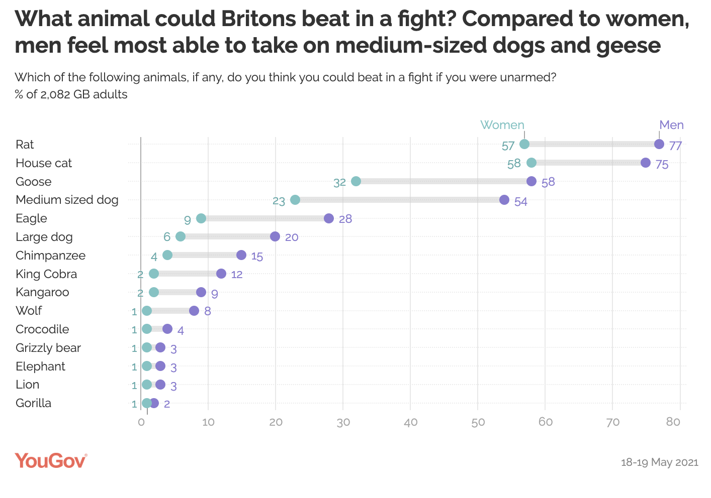{fig-align="center" width=70% fig-dpi=500}](https://yougov.com/en-gb/articles/35979-which-animals-could-britons-beat-fight)

## Type 2

[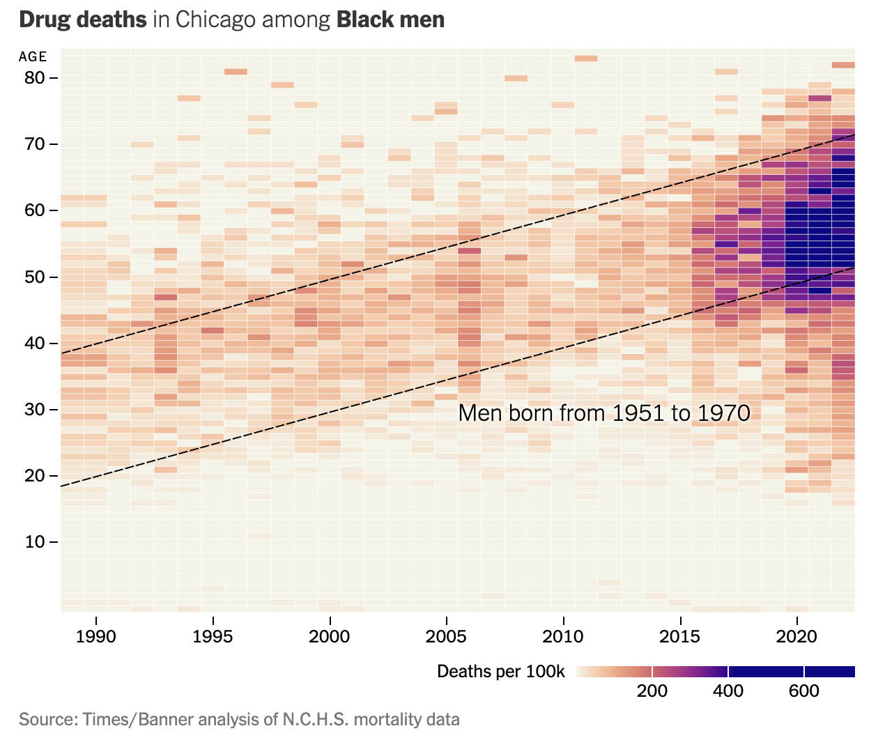{fig-align="center" width=60% fig-dpi=500}](https://www.nytimes.com/2025/01/30/upshot/black-men-overdose-deaths.html)

## Type 3

[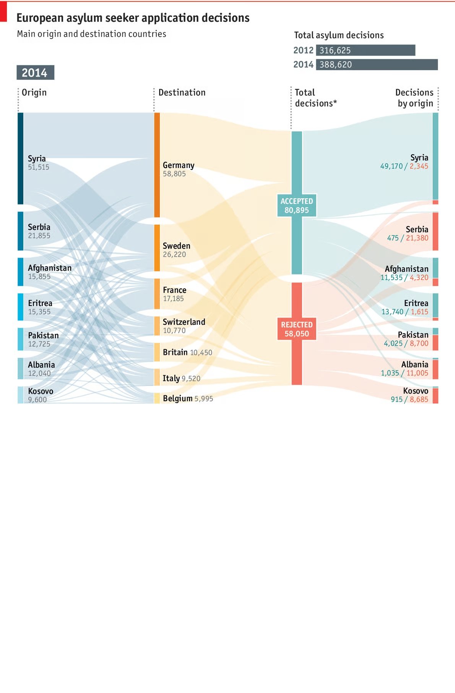{fig-align="center" width=50% fig-dpi=500}](https://www.economist.com/graphic-detail/2015/05/12/seeking-safety?fsrc=scn%2Ftw%2Fte%2Fbl%2Fed%2Fseeking_safety&%3Ffsrc%3Dscn%2F=tw%2Fdc)

## Type 4

[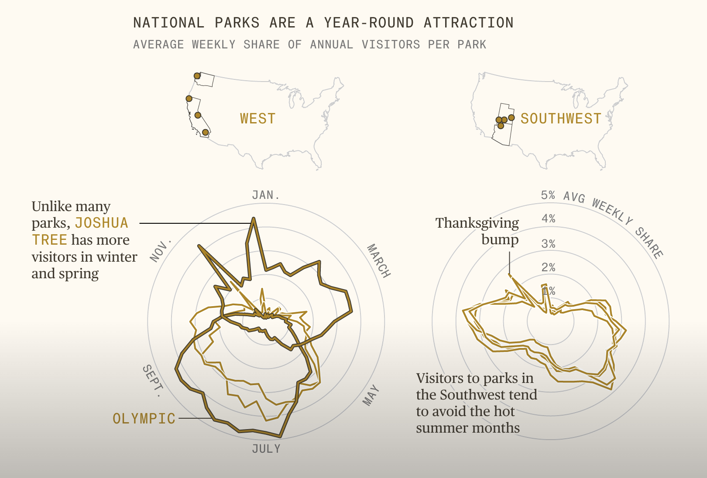{fig-align="center" width=70% fig-dpi=500}](https://www.bloomberg.com/graphics/america-national-parks-guide/?srnd=phx-graphics-v2)

:::

## Trying to go beyond the obvious

::: {.centered}

- I will probably state **obvious** stuff BUT

  - Maybe still good to hear it sometimes
  - I will provide **references** to explore all this in more details
  - I will try to structure and **conceptualize**

- Objectives of the class:

  - Provide tools to nail your data viz
  - Communicate that data viz matters and provide a conceptual lense

:::

::: {.notes}
- I would like you to pay attention to the probably stupid stuff "I already know that" points but even more importantly to the conceptual lense that you will be able to reinvest

- Some points will be very concrete, very hands-on and down to earth
- Other will be much more conceptual bu
:::


## Outline

<br><br><br><br><br>
1. **Why** data viz matters in economics?

<br>
2. **What** are the characteristics of good data viz?

<br>
3. **How** to make an ok data viz?


# Why data viz matters in economics? {.inverse}

# What do we use data viz for in economics?

## Usefulness of data viz, overall

::: {.centered}

- Allows to **synthesize** large amounts of information into a limited space

- Ease **interpretation** (reduce the cognitive load)

- For your audience to not only receive info but also **understand** and **remember** it

:::

## Tables might be arrid {.scrollable}

```{r freedom_press}
freedom_press <- read_delim("data/freedom_press.csv", 
    delim = ";", escape_double = FALSE, trim_ws = TRUE) 

freedom_press |> 
  kable()
```

::: {.notes}
- Information/message might be difficult to parse
:::

## Synthetic and memorable

[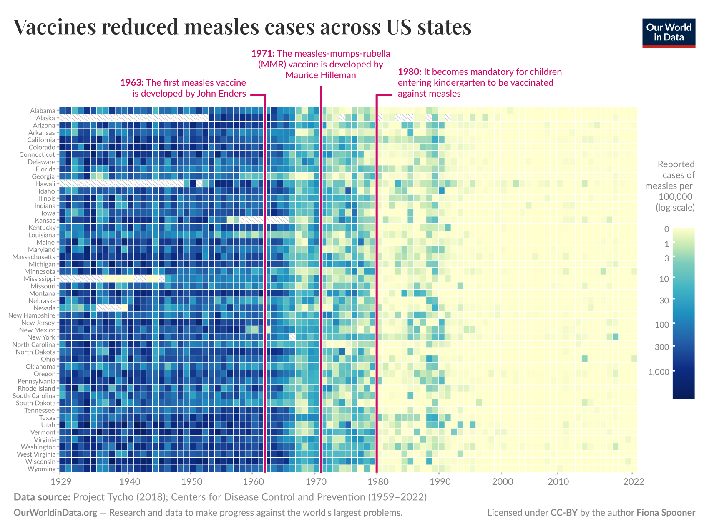{fig-align="center" width=80%}](https://ourworldindata.org/measles-vaccines-save-lives)

## Yearly fluctuations in area of Arctic covered by ice

[{fig-align="center" width=100%}](https://www.datawrapper.de/blog/readers-time)


## Several uses of data viz

<br>

:::: {.columns}

::: {.column width="30%"}

::: {.callout-note title="Graphs to explore" icon=false}

<br>

::: {.r-stack}

- Analyze
- Confirm

:::

<br>

:::

:::

::: {.column width="2%"}

::: 

::: {.column width="30%"}

::: {.callout-note title="Graphs to explain" icon=false}

<br>

::: {.r-stack}

- Inform
- Convince

:::

<br>

:::

:::

::: {.column width="2%"}

::: 

::: {.column width="30%"}

::: {.callout-note title="Graphs for inference" icon=false}

<br>

::: {.r-stack}

- Econ specific
<br><br>

:::

<br>

:::

:::

::::

<br>

::: {.r-stack}
They have different goals and audiences
:::

## Adapting graphs to the audience

::: {.centered .incremental}

- Which potential audiences?

  - **Peers, economists**: can use complex but familiar types of graphs
  - **Non-economists**: think about how they are
  - **You** today: super quick but with basic labels
  - **Future you**: still need to be able to remember what the graph is about 6 months later
  
:::
  
## Different levels of polishing

::: {.centered}

- Graphs for **you** (and your future self): can be quite rough on the edges, but you will want to be able to understand it in the future

- For **presentations**: you have some leeway for explaining orally your graphs

- For the **paper**: there is only a couple of graphs in a paper; make them perfect!

:::

## Explore: make sense of your data

<br>

- Data viz helps a lot to **identify patterns** in data

- That's the role of the exploratory data analysis (**EDA**)

- It may help to: 

  - Understand what is your data and in your data
  - Spot issues in your data 
  - Formulate hypotheses (to test on other data sets)
  - Assess the relevance of some key assumptions

::: {.callout-tip title="Rule"}
Always look at your raw data
:::

## Look at your raw data

```{r anscombe}
#| fig-width: 6
#| fig-align: center
#| code-fold: true

anscombe <- read_delim("data/anscombe.csv", 
# anscombe <- read_delim(here::here("content", "slides", "data/anscombe.csv"),
    delim = ";", escape_double = FALSE, trim_ws = TRUE)

anscombe |> 
  ggplot(aes(x = x, y = y)) +
  geom_point(size = 2) +
  geom_smooth(method = "lm", se = FALSE, fullrange = TRUE, color = base_color) +
  facet_wrap(~ dataset) +
  theme_idid() + 
  labs(
    title = "Same regression line, different data",
    subtitle = "Anscombe's quartet",
    caption = "Same relation, different patterns"
  )
```

::: {.note}

- *eg* might be helpful to **evaluate your modeling assumptions**
- Spot outliers driving your results

:::

<!-- ## Look at your raw data -->

<!-- [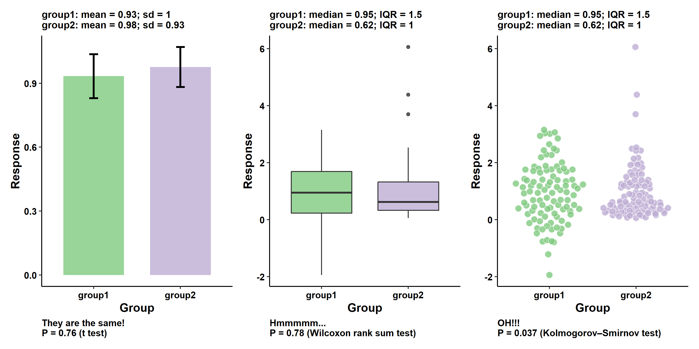{fig-align="center" width=90%}](https://github.com/cxli233/FriendsDontLetFriends) -->


<!-- - Some plots (or summary statistics) help summarize but can also **hide** information -->
<!-- - *eg* might be helpful to **explore balance** -->

## Explain: get your point across

:::: {.columns}

::: {.column width="55%"}

[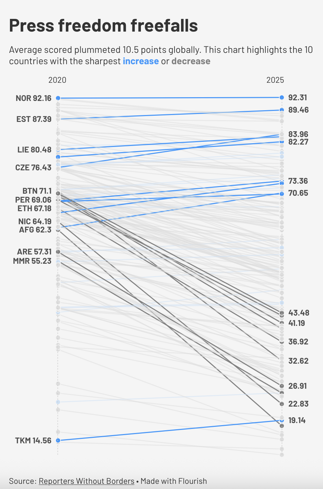{fig-align="center" width=70%}](https://app.flourish.studio/visualisation/24021917/edit)

:::

::: {.column width="40%"}

<br><br><br><br>

- A data viz can be much clearer than a table (not always)
- Can help focus on one specific point
- Convey a **story**


:::

::::

## Specific uses in economics

::: {.centered}

- As **rhetorical** visualization tools for models 

- To **explore** our data

- To check the validity of our **models**

- As **diagnostics**

- To **communicate** results

:::

<!-- ## A rhetorical tool -->

<!-- ```{r pop_gdp_graph} -->
<!-- #| fig-height: 4.5 -->
<!-- #| fig-width: 7 -->
<!-- #| fig-align: center -->
<!-- #| fig-dpi: 400 -->

<!-- gapminder::gapminder |>  -->
<!--   ggplot(aes(x = pop, y = gdpPercap)) +  -->
<!--   geom_point(alpha = 0.4) +  -->
<!--   geom_smooth(method = "lm") +  -->
<!--   scale_x_log10() + -->
<!--   scale_y_log10() + -->
<!--   labs( -->
<!--     title = "Population Against GDP per Capita", -->
<!--     x = "log(Population)", -->
<!--     y = "log(gdpPercapita)" -->
<!--   ) -->
<!-- ``` -->

<!-- ## A rhetorical tool -->

<!-- ```{r pop_gdp_graph_country} -->
<!-- #| fig-height: 5 -->
<!-- #| fig-width: 7 -->
<!-- #| fig-align: center -->
<!-- #| fig-dpi: 400 -->

<!-- gapminder::gapminder |>  -->
<!--   mutate( -->
<!--     country_name = paste(country), -->
<!--     display_country = ifelse(str_starts(country_name, "T"), country_name, NA) -->
<!--   ) |>  -->
<!--   ggplot(aes(x = pop, y = gdpPercap, color = display_country)) +  -->
<!--   geom_point() +  -->
<!--   geom_smooth(method = "lm", se = FALSE, linewidth = 1.5) +  -->
<!--   scale_x_log10() + -->
<!--   scale_y_log10() + -->
<!--   labs( -->
<!--     title = "Within Country Population Against GDP per Capita", -->
<!--     subtitle = "For a subset of countries", -->
<!--     x = "log(Population)", -->
<!--     y = "log(gdpPercapita)", -->
<!--     color = NULL -->
<!--   )  -->
<!-- ``` -->


# Why make *good* data viz?

## Data viz can be obviously deceptive

[{fig-align="center" width=40%}](https://www.reddit.com/r/dataisugly/comments/1cc4rbn/crushing_victory/)

## ...or difficult to interpret

<br>

[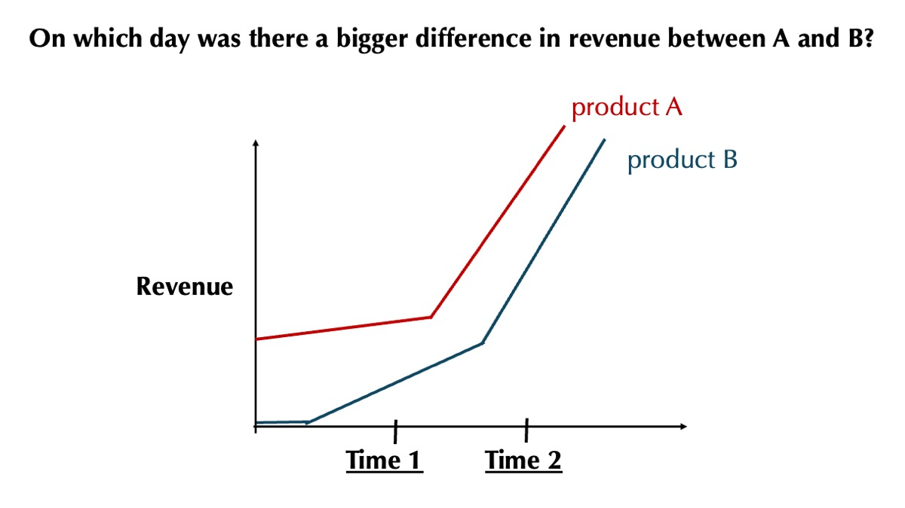{fig-align="center" width=80%}](https://ieeevis.org/year/2024/program/paper_v-short-1081.html)


## The power of data viz

<br>

> *We can easily see patterns presented in certain ways, but if they are presented in other ways, they become invisible [..] 
<br><br>Following perception-based rules, we can present our data in such a way that the important and informative patterns stand out. If we disobey the rules, our data will be incomprehensible or misleading.
<br><br><br>Ware, C. (2012). Information Visualization, Third Edition: Perception for Design

- Charts can be **wrong**. They can also be correct BUT **misleading**^[See [*Defense Against Dishonest Charts*](https://flowingdata.com/projects/dishonest-charts/) on Flowing Data]
- Be mindful of this power when make and read graphs

## Cutting 0 on the y-axis



## Map projections distort the reality

<br><br>

:::: {.columns}

::: {.column width="50%"}

[{fig-align="center" width=60%}](https://whereexactlymaps.com/blogs/articles/an-introduction-to-map-projections)

:::

::: {.column width="50%"}

<br>
[{fig-align="center" width=80%}](https://whereexactlymaps.com/blogs/articles/an-introduction-to-map-projections)

:::

::::

# Data viz and credibility

<br>

>“This paper did not receive the care it deserved” *comment given to a now senior researcher when they submitted a paper with a sketchy graph*

## Credibility and aesthetics

:::: {.columns}

::: {.column width="50%"}

[{fig-align="center" width=90%}](https://practicaltypography.com/why-does-typography-matter.html)

:::

::: {.column width="50%"}

[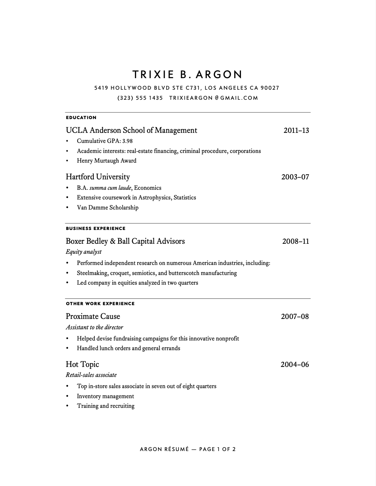{fig-align="center" width=90%}](https://practicaltypography.com/why-does-typography-matter.html)

:::

::::

## Graph aesthetics

::: {.centered}
- Beyond credibility, why make nice looking visualizations? 

- To trigger interest, to intrigue, to **catch the eye**

- That affects how people perceive information

- Nice looking visuals may be more **memorable**

- They can help engage the audience

- Pretty does not always mean non-simple. [Simple graphs have value](https://www.datawrapper.de/blog/in-defense-of-simple-charts).

- In academia, maybe better to keep the design rather minimalist

:::

## Pretty and memorable

[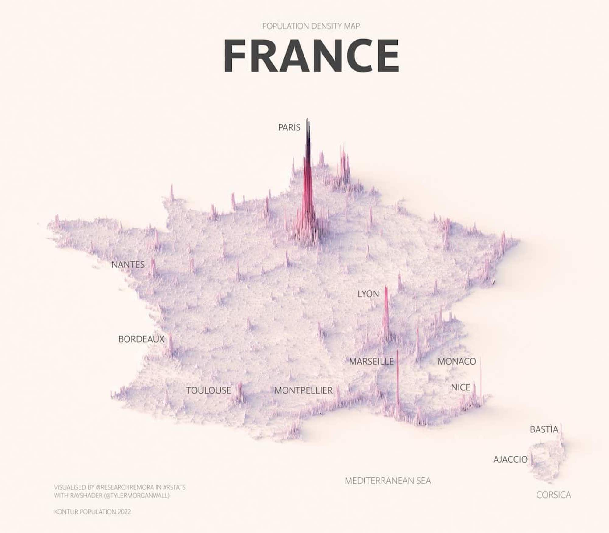{fig-align="center" width=60%}](https://x.com/researchremora)


## Engaging the audience

[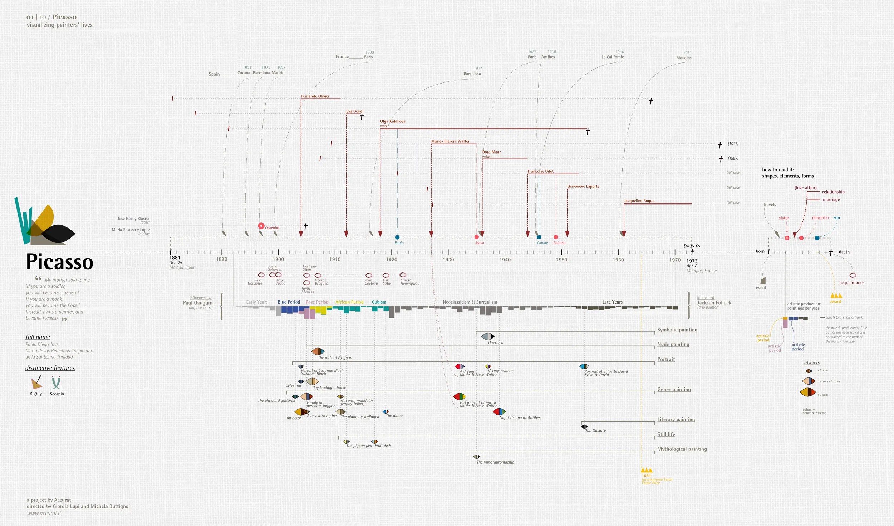{fig-align="center" width=90%}](https://medium.com/accurat-in-sight/beautiful-reasons-c1c6926ab7d7)

# What are the characteristics of good data viz? {.inverse}

# Tell a story

## Which story?

<br>

- Stories resonate with us, humans

- What do you want to show in your graph?

- What is the **message** you want to convey?

- Again, you do not want your audience to receive info, you want them to **understand** and **remember** your message

<br>

::: {.callout-important}

Clearly stating the message you want to convey is the first and most important step of a successful visualization

:::

## 1 dataset, many stories, many graphs

::: {.centered}

- With the same data, you can:

  - Tell a lot of different stories
  
  - Emphasize different points
  
- Making a graph = **choosing a lighting** for your data

- The **type of graph** you choose matters and depends on your story

:::

---

```{r website_100_project, echo=FALSE, fig.dpi=500}
knitr::include_url("https://100.datavizproject.com/", height = "650px")
```

# Cognitive load

## A guiding principle

<br><br>

::: {.callout-note title="A rough definition"}
How easy or difficult it is to parse new information
:::

<br>

- Often want to **decrease the cognitive load** (particularly for academia)

- Can often use this **a guide** for making our data visualization

- As all rules, it is meant to be broken

## Different types of cognitive loads

::: {.centered}

- **Intrinsic** load: inherent complexity of the information

  - *eg*, 3/7 more difficult to compute than 3 + 7
  
- **Germane** load: how familiar is the audience with the new information

  - *eg*, box plots, coefficient plots might be difficult to understand without prior experience
 
- **Extraneous** load: how the new information is presented

  - *eg*, horizontal text, highlight important data points, annotate, etc
  
:::

# Data viz theory

## Importance of theory

::: {.centered}

- There is actually a lot of theory behind data viz:
  
  - Perception, 
  - Colors, 
  - Design,
  - etc

- Can relate to cognitive load 
- But can also **leverage it to make better data viz**
- Worth learning about it and being aware of key principles


:::

<!-- ## Perception -->

<!-- [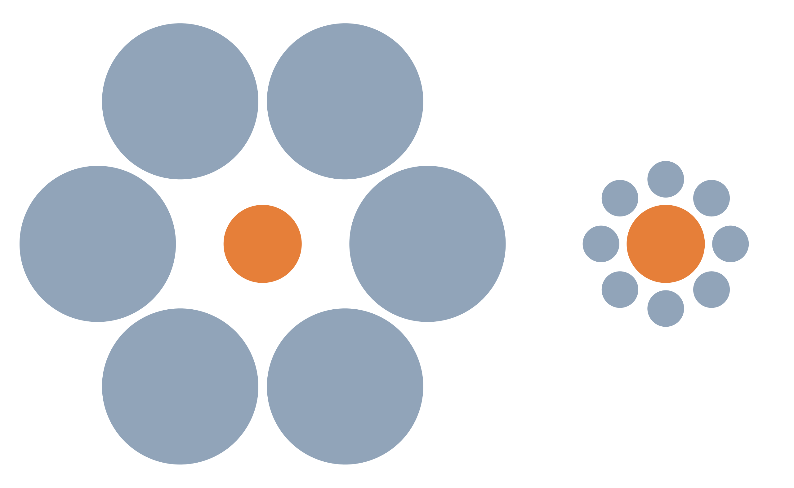{fig-align="center" width=70%}](https://en.wikipedia.org/wiki/Ebbinghaus_illusion) -->

<!-- ::: {.r-stack} -->
<!-- Ebbinghaus illusion -->
<!-- ::: -->

<!-- ## Relative differences matter -->

<!-- [{fig-align="center" width=30%}](https://en.wikipedia.org/wiki/Contrast_effect) -->

<!-- ::: {.r-stack} -->
<!-- Law of simultaneous contrast -->
<!-- ::: -->

## Gestalt principles

:::: {.columns}

::: {.column width="40%"}
<br><br>

- How our brain interprets what we see
- How it organize visual information
- How we group elements together

- Use them to highlight some patterns and downplay others

:::

::: {.column width="60%"}

[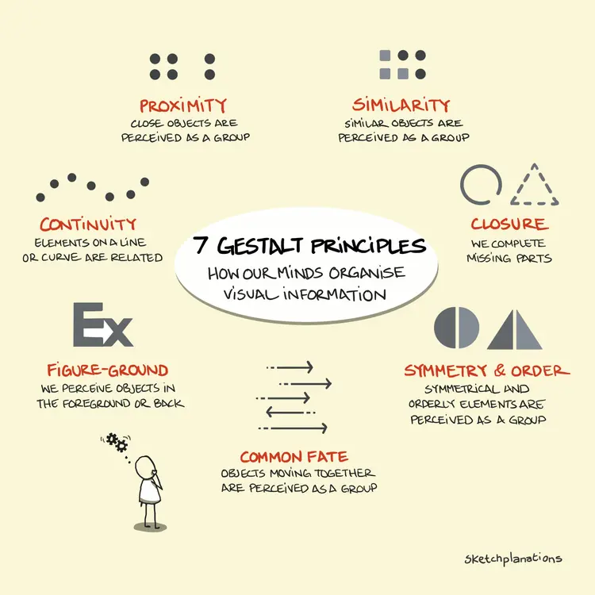{fig-align="center" width=90%}](https://sketchplanations.com/gestalt-principles)

:::

::::


## Data-to-ink ratio 

:::: {.columns}

::: {.column width="40%"}
<br><br><br>

- Introduced by Edward Tufte

- In a nutshell: **avoid clutter**

- Erase non-essential and redundant information

- *"Above all else show the data"*

- Somehow "reduce the cognitive load"

:::

::: {.column width="60%"}

[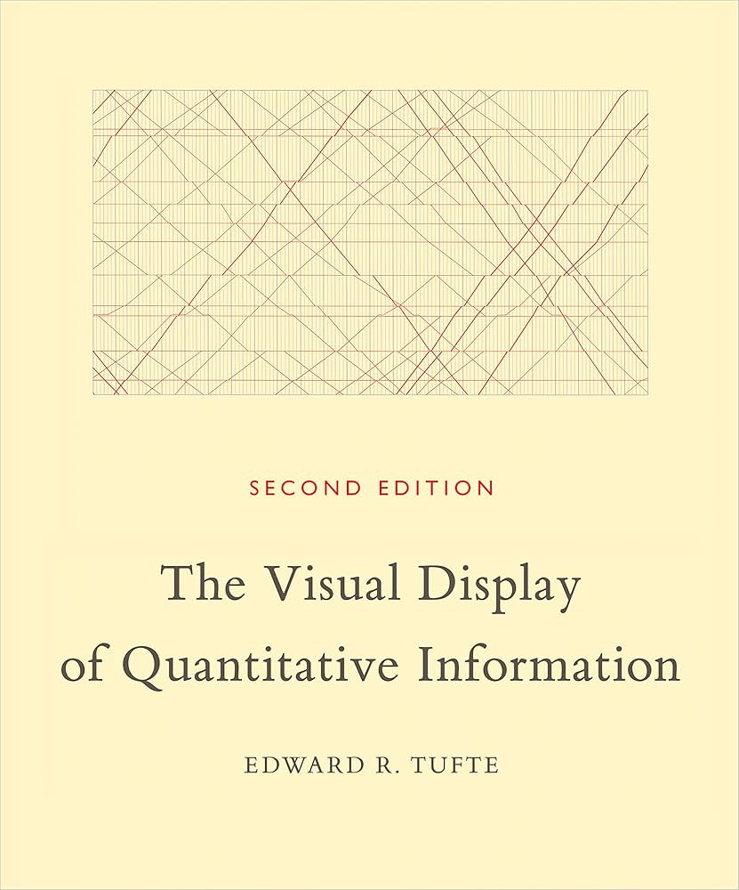{fig-align="center" width=70%}](https://www.edwardtufte.com/book/the-visual-display-of-quantitative-information/)

:::

::::

## Data-to-ink ratio 

<br>

::: {.r-stack}

$\text{data-ink ratio} = \dfrac{\text{data  ink}}{\text{total ink on graph}}$

:::

<br>

:::: {.columns}

::: {.column width="50%"}

[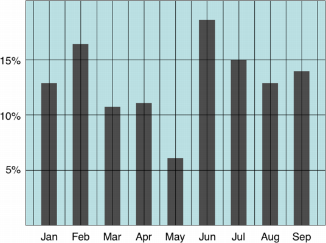{fig-align="center" width=100%}](https://infovis-wiki.net/wiki/Data-Ink_Ratio)

:::

::: {.column width="50%"}


[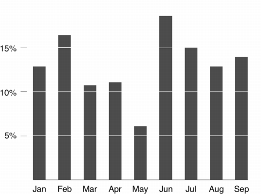{fig-align="center" width=100%}](https://infovis-wiki.net/wiki/Data-Ink_Ratio)

:::

::::

# How to make an ok data viz? {.inverse}

# Non-negotiable rules

## Example data {.scrollable}

```{r ex_data}
ex_data <- gapminder::gapminder |> 
  filter(country %in% c("France", "Japan", "Niger")) |>
  select(country, year, lifeExp) |> 
  group_by(country) |> 
  mutate(lifeExp_norm = lifeExp/min(lifeExp)*100) |> 
  ungroup()

ex_data |> 
  select(-lifeExp_norm) |> 
  kable()
```

## A concrete example

```{r example_inti}
#| fig-width: 20
#| fig-height: 10

ex_plot <- ex_data |>
  ggplot(aes(x = year, y = lifeExp, color = country)) +
  geom_line(linewidth = 1.4) + 
  theme_gray() +
  scale_x_continuous(breaks = seq(1950, 2008, 4)) +
  scale_color_brewer(palette = "Set2")

ex_plot
```

## Legible text

```{r example_legible}
#| fig-width: 7
#| fig-height: 4

ex_plot
```

## Title, clear axis labels and source

```{r example_title}
#| fig-width: 7
#| fig-height: 4

ex_plot <- ex_plot + 
  labs(
    title = "Evolution of average life expectancy at birth",
    x = NULL,
    y = "Life expectancy at birth, in years",
    color = NULL,
    caption = "Source: Gapminder"
  )

ex_plot
```

## Graphs in an oral presentation

::: {.centered}

- **Explain orally what your graph represents!**

  - What is on the x-axis? 

  - What is on the y-axis? 
  
  - What is the message you want to convey?
  
:::

## Avoid low contrast

```{r example_contrast}
#| fig-width: 7
#| fig-height: 4

ex_plot +
  # ggplot(aes(x = year, y = lifeExp, color = country)) +
  scale_color_manual(values = c("#FBF1D1", "lightgrey", "lightblue"))
```

# Good practice

## Stylize

```{r example_style}
#| fig-height: 6
#| fig-align: center

ex_plot <- ex_plot + 
  theme_idid() +
  # scale_color_manual(values = base_color_vect)
  scale_mediocre_d(pal = "portal") 
  # theme_mediocre(pal = "portal")

ex_plot
```

## Limited number of guides break 

```{r example_number_ticks}
#| fig-height: 6
#| fig-align: center

ex_plot <- ex_plot +
  scale_x_continuous(scales::pretty_breaks(n = 5))

ex_plot
```

## Export graphs in PDF (vectorized)

```{r example_pdf, fig.dpi=30}
#| fig-height: 6
#| fig-align: center

ex_plot
```

## An informative title

```{r example_title_info}
#| fig-height: 6
#| fig-align: center

ex_plot <- ex_plot +
  labs(
    title = "Life expectancy remains substantially lower in Niger",
    subtitle = "Evolution of average life expectancy at birth"
  )

ex_plot
```

## Think about the scale of the y-axis

```{r example_y_axis}
#| fig-height: 6
#| fig-align: center

ex_plot + 
  ylim(c(0, NA))
```

## An alternative story

```{r example_alt}
#| fig-height: 6
#| fig-align: center

ex_data |>
  ggplot(aes(x = year, y = lifeExp_norm, color = country)) +
  geom_line(linewidth = 1.5) + 
  theme_idid() +
  scale_mediocre_d(pal = "portal") +
  labs(
    title = "Life expectancy at birth increased sharply in Niger",
    subtitle = "Evolution of an average life expectancy at birth index",
    x = NULL,
    y = "Life expectancy at birth index,\n base 100 in 1952",
    color = NULL,
    caption = "Source: Gapminder"
  )
```

## Avoid using many different colors

<br>

If need more than 7 colors or so:

<br>

:::: {.columns}

::: {.column width="50%"}

- Use another graph
 
[{fig-align="center" width=90%}](https://www.datawrapper.de/blog/colors)

:::

::: {.column width="50%"}

- Group categories together

[{fig-align="center" width=90%}](https://www.datawrapper.de/blog/colors)

:::

::::


## Use intuitive colors

```{r example_intuitive}
#| fig-height: 6
#| fig-align: center

ex_plot +
  scale_color_manual(values = c("#002E91", "#91002E", "#007550")) 
```


## Colorblind-friendly visualizations

[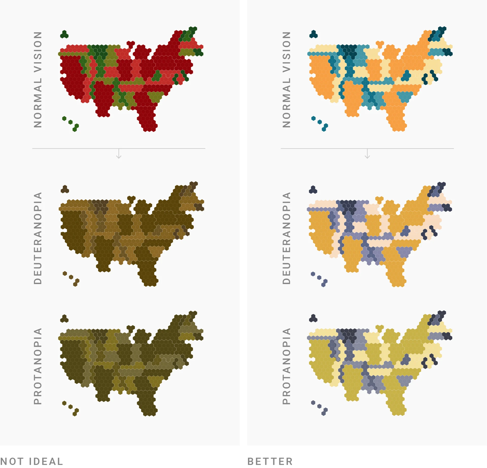{fig-align="center" width=60% fig-dpi=500}](https://www.datawrapper.de/blog/colors)

## Diverging color scale (vs sequential)

::: {.panel-tabset}

## There is a mid-point

[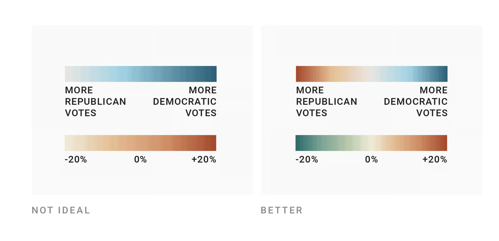{fig-align="center" width=70% fig-dpi=500}](https://www.datawrapper.de/blog/diverging-vs-sequential-color-scales)

## Emphasize extremes

[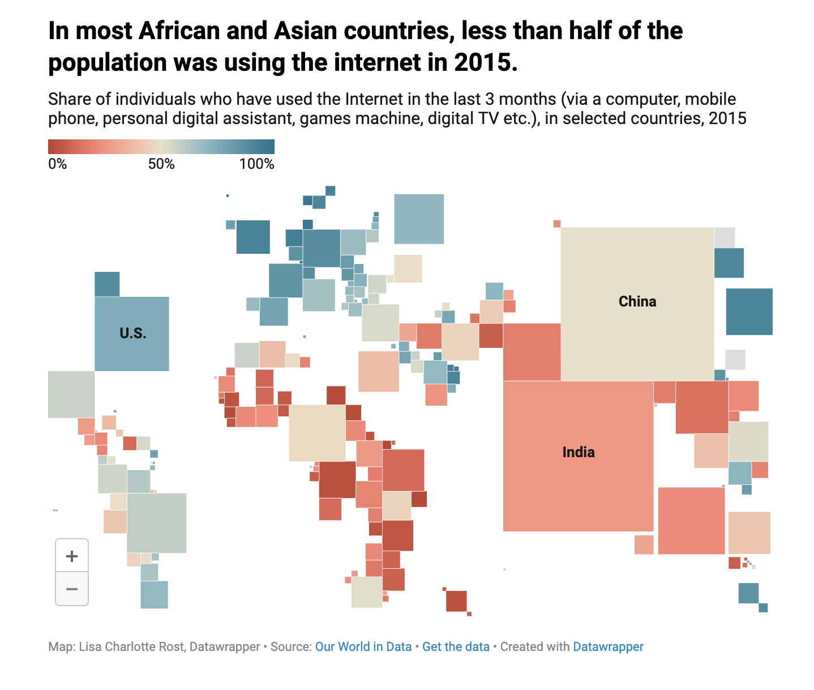{fig-align="center" width=60% fig-dpi=500}](https://www.datawrapper.de/blog/diverging-vs-sequential-color-scales)

## See more difference

[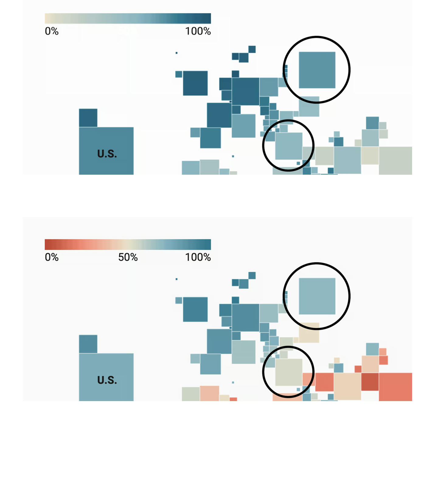{fig-align="center" width=50% fig-dpi=500}](https://www.datawrapper.de/blog/diverging-vs-sequential-color-scales)

:::

## Use gray. Emphasize.

<!-- <br> -->

<!-- - What is your point? -->

<!-- - What do you want the reader to see first? -->

<!-- [{fig-align="center" width=60%}](https://www.datawrapper.de/blog/https://www.datawrapper.de/blog/10-ways-to-use-fewer-colors-in-your-data-visualizations) -->

```{r example_highlight}
#| fig-height: 6
#| fig-align: center

gapminder::gapminder |> 
  filter(continent %in% c("Europe", "Asia", "Africa")) |>
  ggplot(aes(x = year, y = lifeExp, color = country)) +
  geom_line(linewidth = 1.4) + 
  gghighlight(country %in% c("France", "Japan", "Niger"), use_direct_label = FALSE, calculate_per_facet = TRUE) +  
  labs(
    title = "Life expectancy in France, Japan and Niger as compared to their continent",
    subtitle = "Evolution of average life expectancy at birth, by continent",
    x = NULL,
    y = "Life expectancy at birth, in years",
    color = NULL,
    caption = "Source: Gapminder"
  ) +
  theme_idid() +
  scale_color_manual(values = c("#002E91", "#91002E", "#007550")) +
  scale_x_continuous(breaks = scales::pretty_breaks(n = 4)) +
  facet_wrap(~ continent)
```

## Label directly

```{r example_label}
#| fig-height: 6
#| fig-align: center

gapminder::gapminder |> 
  filter(continent %in% c("Europe", "Asia", "Africa")) |>
  ggplot(aes(x = year, y = lifeExp, color = country)) +
  geom_line(linewidth = 1.4) + 
  gghighlight(country %in% c("France", "Japan", "Niger"), calculate_per_facet = TRUE, label_params = list(label.size = 0, size = 6, box.padding = 0.5)) +
  theme_idid() +
  labs(
    title = "Life expectancy in France, Japan and Niger as compared to their own continent",
    subtitle = "Evolution of average life expectancy at birth, by continent",
    x = NULL,
    y = "Life expectancy at birth, in years",
    color = NULL,
    caption = "Source: Gapminder"
  ) +
  scale_color_manual(values = c("#002E91", "#91002E", "#007550")) +
  scale_x_continuous(breaks = scales::pretty_breaks(n = 4)) + 
  facet_wrap(~ continent)
```

## Horizontal text

```{r fig.dpi=500}
#| fig-height: 6

data_eu <- gapminder::gapminder |> 
  filter(continent == "Europe", year == 2007)

data_eu |> 
  ggplot(aes(y = lifeExp, x = country), color = base_color) + 
  geom_point() + 
  geom_segment(aes(y = 65, yend = lifeExp, x = country), linewidth = 0.3) + 
  theme_idid() +
  labs(
    title = "Life Expectancy in Europe",
    y = "Life expectancy in 2007 (in years)", 
    x = NULL
  ) +
  theme(axis.text.x = element_text(angle = 90))
```

## Order your data

:::: {.columns}

::: {.column width="50%"}

```{r fig.dpi=500}
#| fig-width: 5
#| fig-height: 6


data_eu |> 
  ggplot(aes(x = lifeExp, y = country), color = base_color) + 
  geom_point() + 
  geom_segment(aes(x = 65, xend = lifeExp, y = country), linewidth = 0.3) + 
  theme_idid() +
  labs(
    title = "Life Expectancy in Europe",
    x = "Life expectancy in 2007 (in years)", 
    y = NULL
  )
```

:::

::: {.column width="50%"}


```{r fig.dpi=500}
#| fig-width: 5
#| fig-height: 6

data_eu |> 
  mutate(country = fct_reorder(country, lifeExp)) |> 
  ggplot(aes(x = lifeExp, y = country), color = base_color) + 
  geom_point() + 
  geom_segment(aes(x = 65, xend = lifeExp, y = country), linewidth = 0.3) +
  theme_idid() +
  labs(
    title = "Life Expectancy in Europe",
    x = "Life expectancy in 2007 (in years)", 
    y = NULL
  ) 
```

:::

::::

<!-- ## Nicer maps -->

<!-- ```{r} -->
<!-- library(ididvar) -->
<!-- library(tigris) -->
<!-- library(dplyr) -->
<!-- library(ggplot2) -->
<!-- library(gapminder) -->
<!-- library(fixest) -->
<!-- library(rnaturalearth) -->
<!-- library(rnaturalearthdata) -->

<!-- gapminder_sample <- gapminder |>  -->
<!--   mutate( -->
<!--     l_gdpPercap = log(gdpPercap) -->
<!--   ) |>  -->
<!--   filter(continent %in% c("Africa", "Europe")) |> -->
<!--   left_join(country_codes, by = join_by(country)) -->

<!-- world_sf <- rnaturalearth::ne_countries(scale = "medium", returnclass = "sf") |>  -->
<!--   mutate(iso_alpha = adm0_a3) -->

<!-- #define a projection -->
<!-- proj_globe <- -->
<!--   coord_sf(crs = "+proj=ortho +lon_0=30 +lat_0=28", expand = FALSE)  -->

<!-- data_sf <- world_sf |>  -->
<!--   full_join(gapminder_sample, by = join_by(continent, iso_alpha)) -->

<!-- data_sf |>  -->
<!--   ggplot() + -->
<!--   geom_sf(aes(fill = gdpPercap), color = "white", linewidth = 0.1) + -->
<!--   proj_globe + -->
<!--   theme_idid() + -->
<!--   scale_fill_gradient(low = base_color_vect[2], high = base_color_vect[3]) + -->
<!--   # scale_fill_idid() + -->
<!--   labs( -->
<!--     title = "Distribution of Identifying Variation Weights", -->
<!--     fill = "Weight, compared to the average weight" -->
<!--   ) + -->
<!--   theme( -->
<!--     panel.grid.major = element_line(colour = "gray90"), -->
<!--     axis.text.y = ggplot2::element_blank(), -->
<!--     axis.text.x = ggplot2::element_blank() -->
<!--   ) -->
<!-- ``` -->


## Data viz caveats

```{r caveats, echo=FALSE, fig.dpi=500}
knitr::include_url("https://www.data-to-viz.com/caveats.html", height = "550px")
```

## Sometimes you may break the rules

:::: {.columns}

::: {.column width="60%"}

[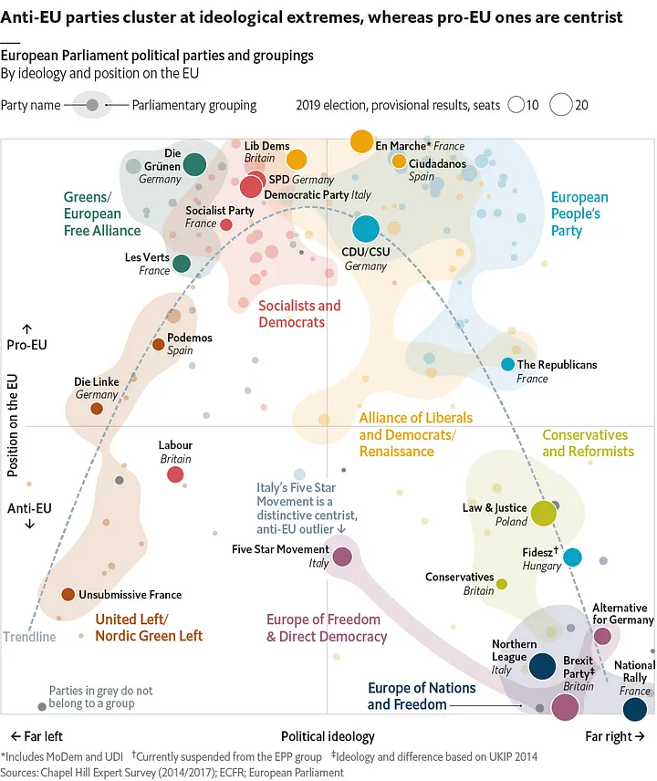{fig-align="center" width=70%}](https://medium.economist.com/why-you-sometimes-need-to-break-the-rules-in-data-viz-4d8ece284919)

:::

::: {.column width="40%"}

<br><br><br>

9 colors

<br>

BUT 

<br>

- Labeled directly
- Shade reinforces grouping

:::

::::


# Choosing a type of graph

## Pay attention to good data viz 

::: {.centered}

- If you start **paying attention** to data viz when you see them, you will see what works, what does not

- It is a process that takes place **in the "background"**: you will learn quickly and not realize it

- You will see nice looking graphs (and hopefully enjoy it)

- You will build better and more impactful graphs

:::

## Know what chart types exist

::: {.centered}

- Know what is possible to do to find what you need

- Know **graph names** (to search the internet regarding how to code them)

- Refer to existing graph (type) galleries:

  - [Data Viz Project](https://datavizproject.com/)
  
  - [Flowing Data - Chart type](https://flowingdata.com/chart-types/)
  
  - [Dataviz Inspiration](https://www.dataviz-inspiration.com/)
  
  - [R graph gallery](https://r-graph-gallery.com/)

:::

---

```{r website_list_types, echo=FALSE, fig.dpi=400}
knitr::include_url("https://datavizproject.com/", height = "600px")
```


##  Type of relationship to show 

<br><br>

In your graph, you may want to show a:

<br>

:::: {.columns}

::: {.column width="50%"}

- Distribution 
- Evolution over time
- Magnitude
- Part of a whole
- Ranking

:::

::: {.column width="50%"}

- Geographical patterns
- Flow 
- Correlations
- Deviation

:::

::::

## Graph type decision tree 

[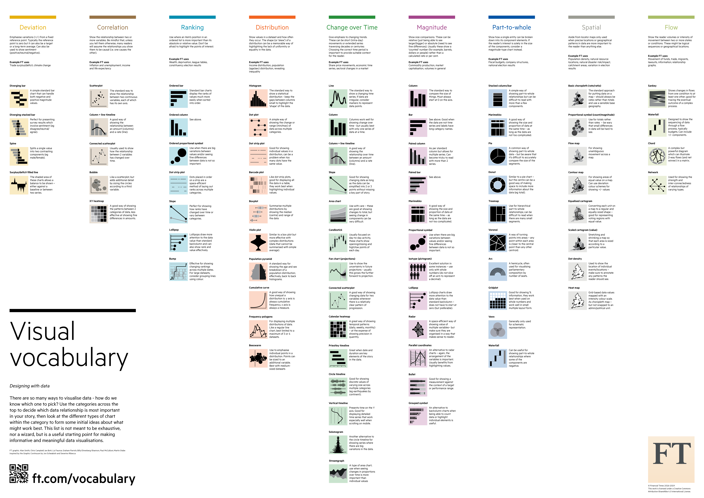{fig-align="center" width=80%}](https://github.com/Financial-Times/chart-doctor/tree/main/visual-vocabulary)

## "Originality" VS "familiarity"

::: {.centered}
- **Original** graphs may trigger interest
  
- **Familiar** graphs may convey the point more easily
  
- My take: 

  - Use the best type of graph, regardless of its originality/familiarity
  
  - If it is different from what people are used to, make it easy to read
:::


<!-- # Data viz in economics {.inverse} -->

<!-- ## Specificities of viz in economics -->

<!-- ::: {.centered} -->

<!-- - We often have to deal with a **massive number of observations** -->

<!-- - We often want to display a specific type of graph: **estimation output** -->

<!-- - Our analysis are often based on **identifying assumptions** that we can sometimes check through graphs -->

<!-- - We often use very complex models. Visualization can help **understand what we are actually estimating** -->

<!-- ::: -->


<!-- ## When do we use graphs in econ?  -->

<!-- ::: {.centered} -->

<!-- - As **rhetorical** visualization tools for models  -->

<!-- - To **explore** our data -->

<!-- - To check the validity of our **models** -->

<!-- - As **diagnostics** -->

<!-- - To **communicate** results -->

<!-- ::: -->

<!-- ## Look at your data -->

<!-- ::: {.panel-tabset} -->

<!-- ### Data -->

<!-- ```{r fatalities} -->
<!-- #| echo: true -->

<!-- library(AER) -->
<!-- data("Fatalities") -->

<!-- Fatalities |> head(5) |> kable() -->
<!-- ``` -->

<!-- ### What's in it? -->

<!-- - Look at the **documentation**: `?Fatalities` or `help(Fatalities)` -->

<!-- - Understand the structure of your data -->

<!-- ```{r fatalities_glimpse} -->
<!-- #| echo: true -->

<!-- #help(Fatalities) -->

<!-- glimpse(Fatalities) -->
<!-- ``` -->

<!-- ### Summary -->

<!-- ```{r datasummary} -->
<!-- #| echo: true -->

<!-- Fatalities |>  -->
<!--   as_tibble() |>  -->
<!--   select(-state) |> #for readability -->
<!--   modelsummary::datasummary_skim() -->
<!-- ``` -->

<!-- ### Take-aways -->

<!-- - We will need to wrangle some of the variables (*eg* jail) -->

<!-- - We have panel data, with repeated observations -->

<!-- - We can **make tons of graphs** to understand what's in our data -->

<!--   - Distribution of the variables -->
<!--   - Temporal evolution -->
<!--   - Spatial distribution -->
<!--   - Relationship between variables -->

<!-- ### Cleaning -->

<!-- ```{r fatalities_cleaning} -->
<!-- #| echo: true -->

<!-- fatalities <- as_tibble(Fatalities) |> -->
<!--   remove_missing() |>  -->
<!--   mutate( -->
<!--     state = str_to_upper(state), -->
<!--     year = as.integer(paste(year)), -->
<!--     jail = (jail == "yes"), -->
<!--     jail_name = ifelse(jail, "Jail penalty", "No jail penalty") -->
<!--   )  -->
<!-- ``` -->

<!-- ::: -->

<!-- ## Explore and understand relationships -->

<!-- ::: {.panel-tabset} -->

<!-- ### Code for graphs -->

<!-- ```{r fatalities_code} -->
<!-- #| echo: true -->

<!-- fatal_jail <- fatalities |>  -->
<!--   ggplot(aes(x = jail_name, y = fatal)) +  -->
<!--   # geom_hline(aes(yintercept = mean(fatal, na.rm = TRUE))) + -->
<!--   geom_jitter(width = 0.25, color = base_color) + -->
<!--   theme_idid() + -->
<!--   labs( -->
<!--     title = "Jail penaly for drunk driving and fatal accidents", -->
<!--     y = "Number of fatal accidents per state", -->
<!--     x = "State law on drunk driving" -->
<!--   ) -->

<!-- fatal_jail_log <- fatal_jail +  -->
<!--   scale_y_log10() +  -->
<!--   labs(y = "Number of fatal accidents\nper state (log scale)") -->
<!-- ``` -->


<!-- ### Graph in levels -->

<!-- ```{r fatal_jail} -->
<!-- #| fig-asp: 0.7 -->
<!-- #| fig-width: 8 -->
<!-- #| fig-align: "center" -->

<!-- fatal_jail -->
<!-- ``` -->

<!-- ### Graph in logs -->

<!-- ```{r fatal_jail_log} -->
<!-- #| fig-asp: 0.7 -->
<!-- #| fig-width: 8 -->
<!-- #| fig-align: "center" -->

<!-- fatal_jail_log -->
<!-- ``` -->

<!-- ::: -->

<!-- ## Finding sources of variation -->

<!-- ::: {.panel-tabset} -->

<!-- ### Code -->

<!-- ```{r law_evol_code} -->
<!-- #| echo: true -->

<!-- # Evolution of law -->
<!-- law_evol <- fatalities |>  -->
<!--   group_by(year) |>  -->
<!--   # summarise(prop_jail = mean(jail, na.rm = TRUE)) -->
<!--   summarise(prop_jail = mean(jail, na.rm = TRUE)) |>  -->
<!--   ggplot(aes(year, prop_jail)) + -->
<!--   geom_line(linewidth = 1.4, color = base_color) + -->
<!--   theme_idid() + -->
<!--   labs( -->
<!--     title = "Adoption of jail sentence for drunk driving", -->
<!--     y = "Proportion of states with a jail law",  -->
<!--     x = NULL -->
<!--   )  -->

<!-- # Making the map -->
<!-- states_sf <- tigris::states( -->
<!--     cb = TRUE, resolution = "20m", year = 2024, progress_bar = FALSE) |> -->
<!--   tigris::shift_geometry() |>  -->
<!--   rename(state = STUSPS) -->

<!-- fatalities_sf <- fatalities |>  -->
<!--   filter(jail) |>  -->
<!--   group_by(state) |>  -->
<!--   mutate(first_year = min(year, na.rm = TRUE)) |>  -->
<!--   ungroup() |>  -->
<!--   filter(year == first_year) |>  -->
<!--   dplyr::full_join(states_sf, by = join_by(state)) |>  -->
<!--   sf::st_as_sf() -->

<!-- law_map <- fatalities_sf |>  -->
<!--   ggplot() + -->
<!--   geom_sf(aes(fill = first_year), color = "white", linewidth = 0.1) + -->
<!--   scale_mediocre_c(pal = "portal", gradient = "left") + -->
<!--   theme_mediocre_map() + -->
<!--   labs( -->
<!--     title = "First year of adoption of the 'jail' law", -->
<!--     subtitle = "In the data set", -->
<!--     fill = NULL -->
<!--   ) + -->
<!--   theme(axis.text.y = element_blank(),  -->
<!--         axis.text.x = element_blank()) -->
<!-- ``` -->

<!-- ### Evolution -->

<!-- ```{r law_evol} -->
<!-- #| fig-asp: 0.7 -->
<!-- #| fig-width: 8 -->
<!-- #| fig-align: "center" -->

<!-- law_evol -->
<!-- ``` -->

<!-- ### Map -->

<!-- ```{r law_map} -->
<!-- #| fig-asp: 0.7 -->
<!-- #| fig-width: 8 -->
<!-- #| fig-align: "center" -->

<!-- law_map -->
<!-- ``` -->

<!-- ::: -->

<!-- ## Balance plots (explore and communicate) -->

<!-- ::: {.panel-tabset} -->

<!-- ### Code -->

<!-- ```{r graph_balance_code} -->
<!-- #| echo: true -->

<!-- graph_balance <- function(balance_var) { -->
<!--   fatalities |>  -->
<!--     ggplot(aes(x = {{ balance_var }}, fill = jail_name, color = jail_name)) +  -->
<!--     geom_density() + -->
<!--     theme_idid() + -->
<!--     scale_mediocre_d() +  -->
<!--     labs( -->
<!--       title = paste("Balance plot for", substitute(balance_var)), -->
<!--       fill = NULL, -->
<!--       color = NULL, -->
<!--       y = "Density" -->
<!--     ) -->
<!-- } -->
<!-- ``` -->

<!-- ### Unemployment -->

<!-- ```{r balance_unemp} -->
<!-- graph_balance(unemp) + -->
<!--   labs(x = "Mean unemployment rate (%)") -->
<!-- ``` -->

<!-- ### Income -->

<!-- ```{r balance_income} -->
<!-- graph_balance(income) +  -->
<!--   scale_x_log10() + -->
<!--   labs(x = "Mean per capita income (log scale)") -->
<!-- ``` -->

<!-- ### Spirits consumption -->

<!-- ```{r balance_spirits} -->
<!-- graph_balance(spirits) + -->
<!--   labs(x = "Spirits consumption (unit ?)") -->
<!-- ``` -->

<!-- ::: -->

<!-- ## Balance table -->

<!-- ::: {.panel-tabset} -->

<!-- ### Why? -->

<!-- <br><br><br> -->

<!-- - **Formal statistical tests**  -->

<!-- - Graphs only provide visual information that can hide informations or lack clarity -->

<!-- ```{r balance_table} -->
<!-- #| echo: true -->

<!-- balance_table <- fatalities |>  -->
<!--   select(-state) |>  -->
<!--   modelsummary::datasummary_balance(formula = ~jail) -->
<!-- ``` -->

<!-- ### Table -->

<!-- ```{r print_balance_table} -->
<!-- balance_table -->
<!-- ``` -->

<!-- ::: -->

<!-- ## Identification strategy {.incremental} -->

<!-- ::: {.centered} -->

<!-- - The setting calls for a TWFE approach (staggered roll-out) -->

<!-- - Identifying assumptions? -->

<!-- - Threats to identification? -->

<!--   - Trends in number of fatalities before adoption -->
<!--   - Other shocks at the time of adoption -->
<!--   - Anticipation: decrease in fatalities before the implementation -->
<!--   - Change in composition of the states -->
<!--   - Spillover effects -->

<!-- - How to explore these? Are graphs helpful? -->

<!-- ::: -->

<!-- ## Parallel trends and event study graph -->

<!-- ::: {.panel-tabset} -->

<!-- ### Code -->

<!-- ```{r event_study} -->
<!-- #| echo: true -->

<!-- first_year <- fatalities |> -->
<!--   filter(jail) |> -->
<!--   group_by(state) |> -->
<!--   mutate(treat_year = min(year, na.rm = TRUE)) |> -->
<!--   ungroup() |> -->
<!--   filter(year == treat_year) |> -->
<!--   select(treat_year, state) -->

<!-- dat <- fatalities |> -->
<!--   left_join(first_year, by = join_by(state)) |> -->
<!--   mutate( -->
<!--     first_year = replace_na(treat_year, 0) -->
<!--   ) -->

<!-- event_study_reg <- feols( -->
<!--   log(fatal) ~ sunab(treat_year, year) | state + year, -->
<!--   data = dat -->
<!-- ) -->

<!-- event_study_graph <- event_study_reg |>  -->
<!--   tidy(conf.int = TRUE) |> -->
<!--   mutate(term = as.integer(str_remove(term, "year::"))) |>  -->
<!--   rbind(c(-1, rep(0, 6))) |>  -->
<!--   ggplot(aes(x = term, y = estimate)) +  -->
<!--   geom_point() +  -->
<!--   geom_pointrange(aes(ymin = conf.low, ymax = conf.high)) +  -->
<!--   geom_vline(xintercept = -1) +  -->
<!--   geom_hline(yintercept = 0, color = "black", linetype = "solid", linewidth = 0.2) +  -->
<!--   theme_idid() + -->
<!--   labs( -->
<!--     title = "Event study graph: law and impact on fatalities", -->
<!--     x = "Number of years relative to the introduction of the law", -->
<!--     y = "Estimate" -->
<!--   ) -->
<!-- ``` -->

<!-- ### Event study graph -->

<!-- ```{r} -->
<!-- event_study_graph -->
<!-- ``` -->

<!-- ::: -->

<!-- ## Model specification -->

<!-- ::: {.centered} -->
<!-- - We will discuss that in the last session -->

<!-- - Along with inference aspects -->

<!-- - Let's just consider a simple model for now, even though it might present obvious issues -->
<!-- ::: -->

<!-- ## Estimation -->

<!-- <br><br><br> -->

<!-- :::: {.columns} -->

<!-- ::: {.column width="50%"} -->

<!-- <br> -->

<!-- ```{r reg} -->
<!-- #| echo: true -->

<!-- reg <- feols( -->
<!--   data = fatalities,  -->
<!--   log(fatal) ~ jail | state + year -->
<!-- ) -->

<!-- reg_table <- msummary( -->
<!--   list(`log fatalities` = reg),  -->
<!--   gof_omit = "IC|Log|R",   -->
<!--   fmt = 4 -->
<!-- ) -->
<!-- ``` -->

<!-- ::: -->

<!-- ::: {.column width="50%"} -->

<!-- ```{r} -->
<!-- reg_table -->
<!-- ``` -->

<!-- ::: -->

<!-- :::: -->

<!-- ## Visualizing estimation output -->

<!-- ::: {.panel-tabset} -->

<!-- ### Code -->

<!-- ```{r coef_plots_code} -->
<!-- #| echo: true -->

<!-- reg_ctrl <- feols( -->
<!--   data = fatalities,  -->
<!--   log(fatal) ~ jail + log(unemp) + log(income) | state + year -->
<!-- ) -->

<!-- coef_plot <- modelsummary::modelplot(list(`No controls` = reg, `Controls` = reg_ctrl)) + -->
<!--   geom_vline(xintercept = 0) + -->
<!--   theme_idid() +  -->
<!--   scale_mediocre_d(pal = "portal") + -->
<!--   labs(title = "Coefficient plot", caption = "R package: modelsummary") -->

<!-- distrib_coef_plot <- reg_ctrl |>  -->
<!--   broom::tidy() |>  -->
<!--   ggplot(aes(y = term)) + -->
<!--   ggdist::stat_halfeye( -->
<!--     aes(xdist = distributional::dist_student_t( -->
<!--       df = df.residual(reg), mu = estimate, sigma = std.error)), -->
<!--     fill = base_color, -->
<!--     color = base_color, -->
<!--     # size = 10,  -->
<!--     alpha = 0.6 -->
<!--   ) +  -->
<!--   theme_idid() + -->
<!--   geom_vline(xintercept = 0, color = base_color) + -->
<!--   labs( -->
<!--     title = "Distribution of estimates", -->
<!--     x = "Point estimate", -->
<!--     y = NULL, -->
<!--     caption = "R package: ggdist" -->
<!--   ) -->
<!-- ``` -->

<!-- ### Coef plot -->

<!-- ```{r coef_plot} -->
<!-- #| fig-asp: 0.7 -->
<!-- #| fig-width: 8 -->
<!-- #| fig-align: "center" -->

<!-- coef_plot -->
<!-- ``` -->

<!-- ### Distribution -->

<!-- ```{r distrib_coef_plot} -->
<!-- #| fig-asp: 0.7 -->
<!-- #| fig-width: 8 -->
<!-- #| fig-align: "center" -->

<!-- distrib_coef_plot -->
<!-- ``` -->

<!-- ::: -->

<!-- ## Diagnostic plots -->

<!-- ```{r} -->
<!-- #| fig-asp: 0.7 -->
<!-- #| fig-width: 8 -->
<!-- #| fig-align: "center" -->

<!-- reg_lm <- lm( -->
<!--   data = fatalities,  -->
<!--   log(fatal) ~ jail + as.factor(state) + as.factor(year) -->
<!-- ) -->

<!-- plot(reg_lm, which = 2) -->
<!-- ``` -->


<!-- ## Handling large numbers of observations -->

<!-- ::: {.panel-tabset} -->

<!-- ### Code -->

<!-- ```{r large_data_code} -->
<!-- #| echo: true -->

<!-- ex_duration <- readRDS("~/Documents/Teaching/data_viz_summer/content/slides/data/ex_duration.RDS") -->
<!-- ex_duration <- readRDS("data/ex_duration.RDS") -->

<!-- raw <- ex_duration |>  -->
<!--   ggplot(aes(x = date, y = duration), color = base_color) +  -->
<!--   geom_point() +  -->
<!--   scale_y_log10() + -->
<!--   theme_idid() +  -->
<!--   labs( -->
<!--     title = "Evolution of the duration of items in time", -->
<!--     x = NULL,  -->
<!--     y = "Duration (in s)" -->
<!--   ) -->

<!-- opacity <- ex_duration |>  -->
<!--   ggplot(aes(x = date, y = duration)) +  -->
<!--   geom_point(alpha = 0.01, color = base_color) +  -->
<!--   scale_y_log10() + -->
<!--   theme_idid() + -->
<!--   labs( -->
<!--     title = "Evolution of the duration of items in time, by channel", -->
<!--     x = NULL,  -->
<!--     y = "Duration (in s)" -->
<!--   ) +  -->
<!--   facet_wrap(~ channel) -->

<!-- heat_map <- ex_duration |>  -->
<!--   ggplot(aes(x = date, y = duration)) +  -->
<!--   geom_bin2d(bins = 70, alpha = 0.9) +  -->
<!--   scale_y_log10() + -->
<!--   theme_idid() + -->
<!--   labs( -->
<!--     title = "Evolution of the duration of items in time, by channel", -->
<!--     x = NULL,  -->
<!--     y = "Duration (in s)" -->
<!--   ) +  -->
<!--   facet_wrap(~ channel) +  -->
<!--   scale_fill_gradientn(colors = base_color_vect) + -->
<!--   # scale_mediocre_c(pal = "coty", gradient = "left") +  -->
<!--   labs(fill = "Number of observations per tile") -->

<!-- binscatter <- ex_duration |>  -->
<!--   ggplot(aes(x = date, y = duration)) +  -->
<!--   geom_point(alpha = 0.01, color = base_color) + -->
<!--   scale_y_log10() + -->
<!--   theme_idid() +  -->
<!--   stat_summary_bin( -->
<!--     fun.y = 'mean',  -->
<!--     bins = 20,  -->
<!--     geom = "point",  -->
<!--     color = base_color, -->
<!--     size = 3 -->
<!--   ) + -->
<!--   labs( -->
<!--     title = "Scatter and binscatter plot",  -->
<!--     x = NULL,  -->
<!--     y = "Duration (in s)" -->
<!--   ) -->
<!-- ``` -->

<!-- ### Raw -->

<!-- ```{r large_data_raw} -->
<!-- #| fig-asp: 0.7 -->
<!-- #| fig-width: 8 -->
<!-- #| fig-align: "center" -->

<!-- raw -->
<!-- ``` -->

<!-- ### Opacity -->

<!-- ```{r large_data_opacity} -->
<!-- #| fig-asp: 0.7 -->
<!-- #| fig-width: 8 -->
<!-- #| fig-align: "center" -->

<!-- opacity -->
<!-- ``` -->

<!-- ### Heatmap -->

<!-- ```{r large_data_heatmap} -->
<!-- #| fig-asp: 0.7 -->
<!-- #| fig-width: 8 -->
<!-- #| fig-align: "center" -->

<!-- heat_map -->
<!-- ``` -->

<!-- ### Binscatter -->

<!-- ```{r large_data_binscatter} -->
<!-- #| fig-asp: 0.7 -->
<!-- #| fig-width: 8 -->
<!-- #| fig-align: "center" -->
<!-- #| warning: false -->

<!-- binscatter -->
<!-- ``` -->

<!-- ::: -->


<!-- ## Rhetorical visualization tools for models  -->

<!-- <br> -->

<!-- [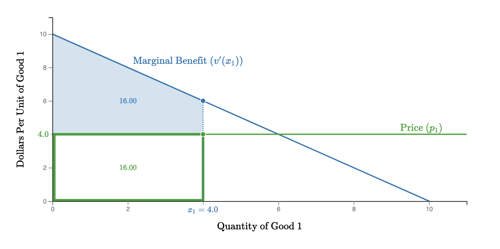{fig-align="center" width=100%}](https://www.econgraphs.org/) -->

<!-- ## For data exploration -->

<!-- - To understand the structure of your data,  -->

<!-- - To build accurate models, that actually represent the data generating process (cf Anscombe's quartet) -->

<!-- ## As diagnostic plots -->

<!-- -  -->


# Main take-away points {.inverse}

## Data viz at large


<!-- :::: {.columns} -->

<!-- ::: {.column width="50%"} -->

::: {.centered} 
 
- Data viz is **powerful**, harness its power

- It can be super **insightful** or equally **deceptive**

- It can make your point **memorable**

- It can also be truly **beautiful** 

- Leverage perception and data viz **principles**

:::

<!-- ::: -->

<!-- ::: {.column width="50%"} -->


<!-- {fig-align="center" width=90%} -->

<!-- ::: -->

<!-- :::: -->


## How to build a graph?

<br><br>

::: {.callout-note title="Take-away messages"}

1. Identify **message**

1. Identify **audience** and objective

1. Find the right **type of graph** for your story and audience

1. Keep **cognitive load** in mind

1. Think about **aesthetics**

1. Follow "**good-practice**" rules

:::

## Summary of concrete recommendations

<br><br>

::: {.callout-note title="Take-away messages"}

- Build legible, understandable and nice looking graphs.

- Have a title and explicit axes; present them.

- Limit the number of colors you use. Use gray. 

- Label your graphs directly, add annotations.

- Overall, facilitate the retrieval of information and reduce cognitive load

:::


## Data viz for economics

::: {.centered}

- Most data viz principles and ideas also apply to economics and academia in general

- There are however some specificities

- In particular, some graphs and **types of analyses** are specific to academic research

- Data viz can be extremely useful for research and communication

:::

# Thanks {.inverse}


